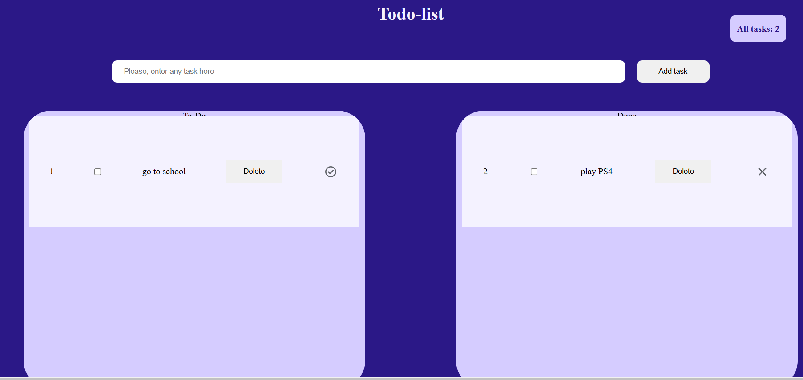

# Task: Simple To-do list

### Запуск Development сервера

<p>Чтобы запустить сервер для разработки, выполните команду:</p>

```json
"start": "webpack serve --open"
```

### Создание билда для production

<p>Чтобы выполнить production сборку, выполните команду:</p>

```json
"build:prod": "webpack --env  mode=production"
```

### Создание билда для development

<p>Чтобы выполнить development сборку, выполните команду:</p>

```json
"build:dev": "webpack --env  mode=development",
```

### lint-staged

будет выполняться перед каждым коммитом в Git.

```json
 "lint-staged": "npx lint-staged",
```

## Структура проекта

Этот проект имеет следующую структуру папок для организации файлов:

## `dist/`

Эта папка содержит 2 файла после build приложения: index.html и index.js

### `node_modules/`

Cодержит все зависимости проектаи.

#### `eslint.config.mjs`

это файл конфигурации для ESLint.



### [Деплой приложения](https://curious-truffle-836082.netlify.app/)

#### В приложение нуждается в дороботке, нужно отладить перетаскивание элементов и исправить сохраниение в localStorage
